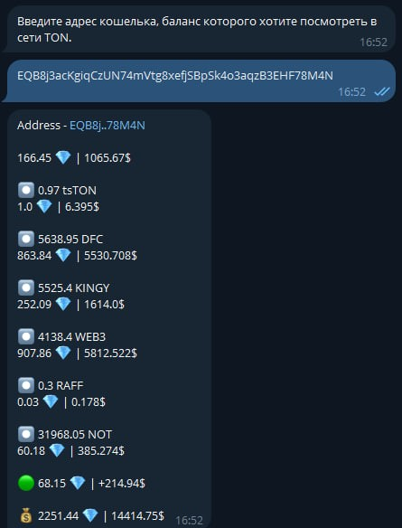

# Wallet control bot

Бот дает возможность просматривать кошелек в сети TON прямо в телеграм боте. 
Так же в заданное время каждый день будут приходить сообщения с отчетом по каждому добавленному кошельку, при включении уведомлений в настройках бота.



## Используемые технологии
<div> 


</div>

## Содержание

* [Особенности](#особенности)
* [Установка](#установка)

## Особенности
* Взаимодействие с  внешним TON API;
* Взаимодействие с базой данных при помощи SQLAlchemy ORM;
* Миграции базы данных с использованием Alembic.

## Установка

### Системные требования:
<div>


</div>

### Протестировать на своем локальном сервере (Linux):
1. Клонируйте репозиторий;
2. Перейдите (`cd`) в клонированный каталог и создайте виртуальное окружение Python (Virtual environment, venv);
3. Активируйте venv и установите pip и все зависимости из `requirements.txt`;
```bash
sudo apt install python3-pip
pip install -r requirements.txt
```
4. Совершите миграцию с помощью Alembic:
```bash
alembic upgrade head
```
5. Скопируйте `.env-example` под именем `.env`, откройте его и заполните переменные;
6. Внутри активированного venv:
```bash
python3 -m bot
```

### Через Systemd
1. Выполните шаги 1-5 из раздела "Протестировать на своем локальном сервере" выше;
2. Скопируйте `wallet_control_bot.example.service` в `wallet_control_bot.service`, откройте и отредактируйте переменные `WorkingDirectory` 
и `ExecStart`;
3. Скопируйте (или создайте симлинк) файла службы в каталог `/etc/systemd/system/`;
4. Активируйте сервис и запустите его:
```bash
sudo systemctl enable wallet_control_bot --now
```
5. Проверьте, что сервис запустился:
```bash
sudo systemctcl status wallet_control_bot
```
